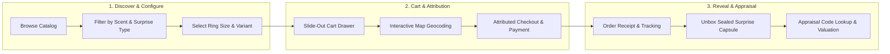
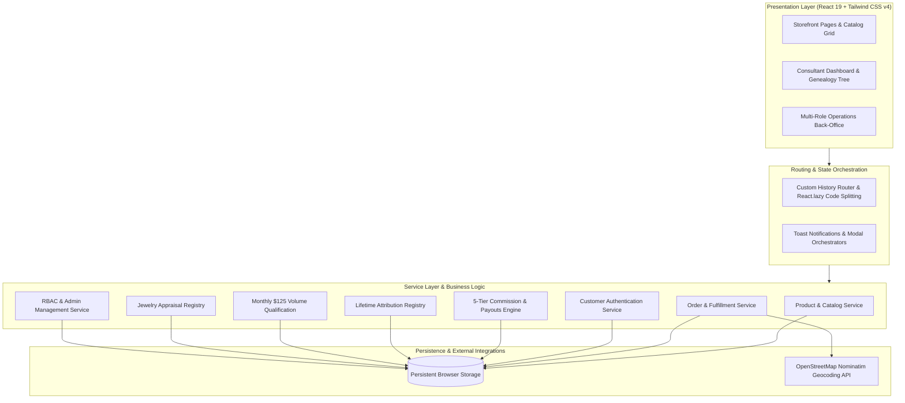
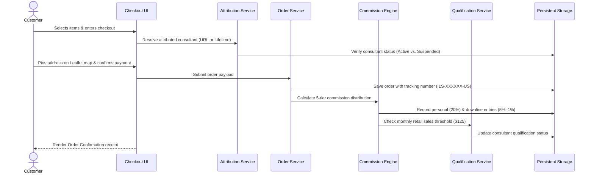

<div align="center">

<a href="https://github.com/flowfoundryaienterprise/Ilovesuprises-frontend">
  
</a>

# I Love Surprises Platform

### Handcrafted Soy Candles & Bath Treats with Hidden Cash & Fine Jewelry Reveals

A direct-to-consumer (DTC) sensory e-commerce storefront delivering unboxing excitement, a multi-tier representative affiliate network, interactive Leaflet delivery mapping, customer rewards, and a centralized operations console.

<br />

[](https://github.com/flowfoundryaienterprise/Ilovesuprises-frontend)

<br />

[](https://react.dev/)
[](https://www.typescriptlang.org/)
[](https://vite.dev/)
[](https://tailwindcss.com/)
[](https://supabase.com/)
[](https://firebase.google.com/)
[](https://leafletjs.com/)
[](https://oxc.rs/)

</div>

---

## 📋 Table of Contents

- [Product Snapshot](#-product-snapshot)
- [Key Features](#-key-features)
- [How It Works](#-how-it-works)
- [System Architecture](#-system-architecture)
- [Technology Stack](#-technology-stack)
- [Project Structure](#-project-structure)
- [Application Modules](#-application-modules)
- [Authentication & Authorization](#-authentication--authorization)
- [Data Flow](#-data-flow)
- [Data & State Persistence](#-data--state-persistence)
- [Installation & Setup](#-installation--setup)
- [Environment Variables](#-environment-variables)
- [Available Scripts](#-available-scripts)
- [UI / UX & Design System](#-ui--ux--design-system)
- [Responsive Design](#-responsive-design)
- [Deployment](#-deployment)
- [Testing & Quality Assurance](#-testing--quality-assurance)
- [Project Status](#-project-status)
- [Contributing](#-contributing)
- [Security](#-security)
- [License](#-license)
- [Repository & Maintainer](#-repository--maintainer)
- [Final Project Summary](#-final-project-summary)

---

## 📌 Product Snapshot

**I Love Surprises** is an interactive direct-to-consumer (DTC) and direct-selling e-commerce platform built for artisanal reveal products. Customers purchase hand-poured soy candles, wax melts, and bath products containing sealed capsules with real cash prizes ($2 to $2,500) or genuine fine jewelry (valued up to $7,500).

| Attribute | Specification |
| :--- | :--- |
| **Product Categories** | Jewelry Candles, Cash Candles, Wax Melts, Bath Bombs, Soaps, Novelty Gifts |
| **Target Audience** | Retail consumers seeking giftable unboxing experiences; independent direct-selling consultants |
| **Core Value Proposition** | Premium handcrafted aromas paired with authentic collectible reveals and a transparent affiliate model |
| **Business Architecture** | Unified DTC storefront, 5-tier direct-selling compensation engine, and administrative back-office |

---

## ✨ Key Features

### 🛍️ Customer Experience & Commerce
* **Dynamic Catalog & Multi-Facet Filtering**: Browse products with instant filtering by category, reveal type (Cash, Jewelry, Trinket, Charm, Mystery), ring size (5–11), scent notes, price bracket, and in-stock availability.
* **Interactive Product Customization**: High-resolution image galleries, ring size selectors, real-time inventory indicators, scent profile tags, and verified customer reviews.
* **Slide-Out Cart Drawer**: Persistent shopping cart with line-item customization, live subtotal computation, and a visual free-shipping progress tracker.
* **Interactive Map Checkout**: Multi-step checkout featuring an embedded Leaflet map modal with OpenStreetMap Nominatim reverse geocoding for pinpoint address selection.
* **Order Tracking & Receipt Generation**: Instant order confirmation with simulated US tracking numbers (`9400...`), order status timelines, and celebratory unboxing animations.
* **Customer Account Management**: Self-service profile editing, saved address book, order history ledger, wishlist curation, and localized currency selection (USD, CAD, EUR, GBP, AUD).

### 💎 Jewelry Appraisal Verification (`/appraise`)
* **Secret Code Lookup**: Customers input the unique authentication certificate code found inside their revealed jewelry capsule to inspect evaluated retail values, gem cuts, material compositions, and serial numbers.
* **Customer Appraisal Submissions**: Public evaluation form allowing customers to request valuation assessments for legacy or uncataloged reveal pieces.

### 🤝 Consultant & Affiliate Network (`/affiliate`)
* **5-Tier Commission Engine**: Automated tiered payout calculation:
  * **Personal Retail Sales**: 20% commission
  * **Tier 1 Downline**: 5%
  * **Tier 2 Downline**: 4%
  * **Tier 3 Downline**: 3%
  * **Tier 4 Downline**: 2%
  * **Tier 5 Downline**: 1%
* **Monthly Volume Qualification Tracker**: Real-time evaluation of the mandatory **$125/month retail customer sales threshold** required to unlock downline earnings (personal consultant purchases are strictly excluded).
* **Interactive Genealogy Tree**: Visual hierarchy tracking downline team structures, active ranks, member counts, and team sales volume.
* **Performance Analytics**: Time-series charts visualizing commission earnings, conversion rates, and referral traffic over time.
* **Lifetime Customer Attribution**: Permanent representative-to-customer binding ensuring consultants receive commission on subsequent customer purchases.
* **Payouts Management**: Fund withdrawal request workflow supporting PayPal, Direct Bank Transfer, Venmo, and Check.
* **Branded Marketing Kit**: Downloadable promotional banners and personalized referral link generators.

### 🛡️ Multi-Role Administration (`/admin`)
* **Role-Based Access Control (RBAC)**: Support for Super Admin, Store Manager, Affiliate Director, Support Agent, and Auditor profiles with granular tab authorization.
* **Commerce Operations**: Order fulfillment status tracking, refund processing, and promotional discount code management.
* **Catalog Controls**: Product and collection creation, inventory adjustments, and price overrides.
* **Commission Ledger**: Review, approve, or reject pending consultant commissions and process withdrawal requests.
* **Representative Directory**: Consultant directory with status auditing and suspension toggles.
* **Appraisal Ledger**: Administrative repository for managing authorized appraisal codes and valuations.

---

## 🧠 How It Works

The platform operates across three primary lifecycles: discovering and customizing products, checking out with representative attribution, and verifying reveals post-purchase.



---

## 🏗️ System Architecture

The application is engineered as a standalone Single-Page Application (SPA) leveraging React 19 concurrent features, Tailwind CSS v4 design tokens, and client-side service layer abstractions.



---

## 🛠️ Technology Stack

| Layer | Technology | Version | Purpose |
| :--- | :--- | :--- | :--- |
| **UI Framework** | React | `19.2.8` | Component rendering, concurrent hooks, and UI architecture |
| **Language** | TypeScript | `~6.0.2` | End-to-end type safety across models, services, and views |
| **Bundler & Dev Server** | Vite | `8.2.2` | High-speed ESM development server and production bundler |
| **Styling** | Tailwind CSS | `4.3.3` | Utility-first styling via `@tailwindcss/vite` and CSS tokens |
| **Motion & Animation** | Framer Motion | `13.1.1` | Tactile micro-interactions, modal transitions, and route animations |
| **Icons** | Lucide React | `1.37.0` | Comprehensive icon set across navigation and management panels |
| **Mapping & Geocoding** | Leaflet | `1.9.4` | Interactive address location picker with OpenStreetMap reverse geocoding |
| **Routing** | Custom Browser Router | Custom | Native HTML5 History API router with `React.lazy` code splitting |
| **State & Persistence** | Client Service Layer | Custom | Persistent browser registries for orders, auth, catalogs, and commissions |
| **Code Quality** | Oxlint | `1.79.0` | High-performance Rust-based static code analysis |

---

## 📁 Project Structure

```text
ilovesurprises-platform/
├── public/                         # Static assets and media files
│   ├── assets/ilovesurprises/      # Categorized imagery (hero, products, banners, appraisals)
│   ├── favicon.svg                 # Application favicon
│   ├── logo.png                    # High-resolution brand identity logo
│   ├── robots.txt                  # Search engine crawler directives
│   └── sitemap.xml                 # XML sitemap configuration
├── src/                            # Application source code
│   ├── components/                 # Reusable UI & domain-specific components
│   │   ├── account/                # Customer profile, addresses, wishlist, order history
│   │   ├── admin/                  # Administrative management tabs, tables, and forms
│   │   ├── affiliate/              # Consultant dashboard, genealogy tree, charts, payouts
│   │   ├── auth/                   # Authentication modals, login, and registration forms
│   │   ├── cart/                   # Slide-out cart drawer with live subtotal computation
│   │   ├── checkout/               # Multi-step checkout form and Leaflet map location picker
│   │   ├── home/                   # Hero banner, category carousels, customer reviews
│   │   ├── layout/                 # Main header, footer, minimal checkout header, rep banner
│   │   ├── products/               # Product cards, catalog grid, and filter sidebar
│   │   ├── seo/                    # Dynamic document head and OpenGraph metadata
│   │   └── ui/                     # Primitives (modals, skeletons, toast notifications)
│   ├── constants/                  # Currency, regional options, and business rules
│   ├── data/                       # Static catalogs, navigation schemas, and geo data
│   ├── hooks/                      # Custom React hooks (usePathname history router)
│   ├── pages/                      # Top-level route views (Home, Shop, Admin, Affiliate, etc.)
│   ├── services/                   # Business logic, state services, and persistence layer
│   ├── types/                      # TypeScript interfaces and domain models
│   ├── utils/                      # Helper utilities (image fallbacks, search ranking)
│   ├── App.tsx                     # Main router and global state orchestration
│   ├── index.css                   # Global CSS, design tokens, and Tailwind v4 directives
│   └── main.tsx                    # Application DOM entry point
├── .env.example                    # Environment variable template
├── .gitignore                      # Git exclusion rules
├── .oxlintrc.json                  # Oxlint configuration
├── index.html                      # Entry HTML document with Google Fonts & OpenGraph meta
├── package.json                    # Dependencies, scripts, and package metadata
├── tsconfig.app.json               # Application-specific TypeScript compiler options
├── tsconfig.json                   # Root TypeScript project reference
├── tsconfig.node.json              # Node tooling TypeScript compiler options
└── vite.config.ts                  # Vite 8 configuration with React and Tailwind plugins
```

---

## 🧩 Application Modules

| Route / View | Component | Description |
| :--- | :--- | :--- |
| `/` | `Home.tsx` | Landing page featuring hero banners, category carousels, featured reveals, and customer reviews |
| `/shop` | `Shop.tsx` | Searchable and filterable master product catalog with multi-facet sidebar |
| `/product/:slug` | `ProductDetails.tsx` | Detailed product specifications, scent profiles, variant selection, and reviews |
| `/collection/:handle` | `Collection.tsx` | Filtered collection landing page (e.g., Cash Candles, Jewelry Candles, Wax Melts) |
| `/categories` | `Categories.tsx` | Visual index of product categories with item counts and category descriptions |
| `/checkout` | `Checkout.tsx` | Multi-step checkout with address validation, Leaflet map picker, and payment simulation |
| `/order-confirmation/:id` | `OrderConfirmation.tsx` | Post-purchase receipt with generated tracking numbers and itemized breakdown |
| `/account` | `Account.tsx` | Customer profile, address book, order history, and regional preferences |
| `/affiliate` | `AffiliateDashboard.tsx` | Consultant portal with earnings metrics, genealogy tree, qualification progress, and payouts |
| `/admin` | `AdminDashboard.tsx` | Administrative suite for orders, products, commissions, staff permissions, and CMS settings |
| `/admin/login` | `AdminLogin.tsx` | Staff authentication portal with role presets |
| `/appraise` | `AppraiseJewelry.tsx` | Public jewelry appraisal code verification tool and evaluation request form |
| `/rewards` | `Rewards.tsx` | Customer loyalty program overview, points structure, and redemption tiers |
| `/about` | `About.tsx` | Brand background, artisan hand-pouring process, and product craftsmanship |
| `/contact` | `Contact.tsx` | Customer support contact form and corporate communication channels |
| `/faqs` | `FAQ.tsx` | Frequently asked questions regarding orders, candle care, reveals, and shipping |
| `/refund-policy` | `RefundPolicy.tsx` | Official return and refund policy documentation |
| `/shipping-policy` | `ShippingPolicy.tsx` | Domestic and international delivery terms, transit times, and rates |
| `/terms` | `Terms.tsx` | Terms of service and legal conditions |
| `/privacy` | `PrivacyPolicy.tsx` | Privacy policy and data handling documentation |
| `/official-rules` | `OfficialRules.tsx` | Regulatory disclosures and sweepstakes rules governing surprise reveals |

---

## 🔐 Authentication & Authorization

### Customer Authentication
* **Client-Side Auth Service (`customerAuthService.ts`)**: Supports email/password registration, password strength metering, and login with session persistence in browser storage.
* **Profile Management**: Customers manage profile details, multiple shipping addresses, and regional preferences.

### Administrative Role-Based Access Control (RBAC)
Staff accounts are partitioned into distinct operational roles defined in `src/types/admin.ts`:

| Role | Badge | Permissions & Scope |
| :--- | :--- | :--- |
| **Super Admin** | Full Access | Unrestricted control over commerce, reps, payouts, settings, and permissions. |
| **Store Manager** | Commerce & Ops | Manages catalog, inventory, order refunds, discount promotions, and sales reports. |
| **Affiliate Director** | Reps & Payouts | Oversees representatives, memberships, downline genealogy, and commission payout approvals. |
| **Support Agent** | Customer Care | Reads customer orders, inspects tracking details, processes returns, and manages inquiries. |
| **Auditor** | Read Only | Inspection access across financial reports, orders, and commission ledgers without edit permissions. |

---

## 🔄 Data Flow

The sequence below illustrates how an order is processed, attributed to a consultant, and routed to the commission ledger:



---

## 🗄️ Data & State Persistence

The application operates as a standalone frontend with modular services backed by persistent browser `localStorage` schemas:

| Storage Key | Schema Description | Service Responsible |
| :--- | :--- | :--- |
| `ils_registered_customers_v1` | Registered customer profiles and credentials | `customerAuthService.ts` |
| `ilovesurprises_orders_v1` | Customer order ledger, line items, and tracking numbers | `orderService.ts` |
| `ilovesurprises_lifetime_attributions_v1` | Permanent customer-to-consultant attribution bindings | `attributionService.ts` |
| `ilovesurprises_monthly_qualifications_v1` | Monthly $125 retail customer sales qualification records | `qualificationService.ts` |
| `ils_admin_commissions_v1` | 5-tier commission ledger records and payout states | `commissionService.ts` |
| `ils_admin_representatives_v1` | Consultant directory records, downlines, and statuses | `representativeService.ts` |
| `ils_admin_products_override_v1` | Catalog overrides, inventory levels, and prices | `adminService.ts` |
| `ils_admin_roles_permissions_v1` | Administrative role definitions and tab permissions | `adminService.ts` |

---

## ⚙️ Installation & Setup

### Prerequisites
* **Node.js**: `v18.0.0` or higher
* **npm**: `v9.0.0` or higher

### Step-by-Step Setup

1. **Clone the repository**:
   ```bash
   git clone https://github.com/flowfoundryaienterprise/Ilovesuprises-frontend.git
   cd Ilovesuprises-frontend
   ```

2. **Install dependencies**:
   ```bash
   npm install
   ```

3. **Configure environment template**:
   ```bash
   cp .env.example .env.local
   ```

4. **Start local development server**:
   ```bash
   npm run dev
   ```

5. Open your browser and navigate to `http://localhost:5173`.

---

## 🔑 Environment Variables

The project operates out-of-the-box as a standalone client-side application. The `.env.example` file is included as a baseline template for future API integrations:

```env
# I Love Surprises - Frontend Standalone Environment Configuration
# Standalone frontend environment configuration.
# Add any future frontend-specific environment variables here.
```

> **Security Note**: Never commit API keys, production database credentials, or secret tokens into version control.

---

## 📜 Available Scripts

The following scripts are defined in `package.json`:

| Command | Script | Description |
| :--- | :--- | :--- |
| `npm run dev` | `vite` | Starts the Vite local development server with Hot Module Replacement (HMR). |
| `npm run build` | `tsc -b && vite build` | Runs TypeScript compilation check and bundles production assets. |
| `npm run lint` | `oxlint` | Executes Oxlint across TypeScript and TSX files for static analysis. |
| `npm run preview` | `vite preview` | Serves the production build output locally for preview and validation. |

---

## 🎨 UI / UX & Design System

The application features a curated luxury aesthetic tailored for reveal-experience retail:

* **Color Tokens**:
  * Primary Accent: Ruby Crimson (`#D30915`, hover `#B60711`)
  * Secondary Accent: Royal Plum (`#54217F`, hover `#6E2CA0`)
  * Neutral Ink: Charcoal Dark (`#141219`)
  * Surface Muted: Warm Pearl (`#FFFAF8`)
* **Typography**:
  * Headings: `Outfit` & `Plus Jakarta Sans`
  * Brand & Display Accents: `Oleo Script`
* **Micro-Interactions**: Smooth hover elevations, button depression physics, and drawer transition easing configured via CSS tokens (`--ease-quick`, `--duration-micro`).

---

## 📱 Responsive Design

The interface is built mobile-first with adaptive layouts supporting all form factors:

* **Mobile Viewports (< 640px)**: Bottom navigation consideration, slide-out hamburger menus, full-screen cart drawer, and touch-optimized quantity steppers.
* **Tablet Viewports (640px – 1024px)**: 2-column product grids, compact administrative tables, and responsive modal dialogues.
* **Desktop Viewports (> 1024px)**: Multi-column mega-menus, sticky product detail sidebars, expanded genealogy visualizers, and split-screen administrative consoles.

---

## 🚀 Deployment

The application compiles into an optimized static Single-Page Application (SPA) inside the `dist/` directory.

### Build Command
```bash
npm run build
```

### Static Hosting Configuration
This build can be deployed to any modern static hosting platform (Vercel, Netlify, Cloudflare Pages, AWS S3/CloudFront, or GitHub Pages). 

Configure a Single-Page Application (SPA) rewrite rule directing all route requests to `/index.html`:

```nginx
# Example Nginx SPA Rewrite Configuration
location / {
  try_files $uri $uri/ /index.html;
}
```

---

## 🧪 Testing & Quality Assurance

Static verification is enforced through TypeScript compilation and Oxlint:

```bash
# Verify static lint rules
npm run lint

# Verify type correctness and production bundling
npm run build
```

---

## 📊 Project Status

| Capability / Area | Status | Implementation Details |
| :--- | :---: | :--- |
| **Storefront & Catalog** | ✅ Completed | Full catalog, multi-facet filtering, variant selectors, reviews |
| **Cart & Checkout** | ✅ Completed | Slide-out cart drawer, Leaflet map location picker, payment simulations |
| **Order Tracking** | ✅ Completed | Order receipt generation, simulated US tracking numbers |
| **Jewelry Appraisal** | ✅ Completed | Code lookup verification, public customer submission workflow |
| **Affiliate System** | ✅ Completed | 5-tier commission calculations, $125/mo qualification, genealogy tree |
| **Admin Back-Office** | ✅ Completed | Multi-role RBAC, catalog management, order refunds, commission ledger |
| **Client Persistence** | ✅ Completed | Browser `localStorage` service registries for orders, auth, and products |
| **Backend API Integration** | 🚧 Architecture Ready | Service layer abstractions isolated and ready for REST/GraphQL APIs |

---

## 🤝 Contributing

Contributions are welcomed. Please follow this standard workflow:

```text
Fork Repository
       ↓
Create Feature Branch (git checkout -b feat/feature-name)
       ↓
Implement Changes & Follow Code Conventions
       ↓
Run Lint & Type Checks (npm run lint && npm run build)
       ↓
Commit with Imperative Message (git commit -m "feat: description")
       ↓
Push to Branch & Open Pull Request
```

---

## 🔒 Security

* **Secret Hygiene**: No API keys, secret credentials, or production tokens are committed to this repository.
* **Input Sanitization**: Client-side form inputs and search queries are sanitized against XSS attacks.
* **Reporting Vulnerabilities**: If you discover a security vulnerability, please open an issue in the repository or notify the maintainers privately.

---

## 📄 License

This repository and its assets are marked as private and proprietary (`"private": true` in `package.json`). All rights reserved.

---

## 🏢 Repository & Maintainer

* **Repository**: [flowfoundryaienterprise/Ilovesuprises-frontend](https://github.com/flowfoundryaienterprise/Ilovesuprises-frontend)
* **Default Branch**: `Feat/Frontend`

---

## ⭐ Final Project Summary

The **I Love Surprises Platform** combines sensory e-commerce, multi-tier direct selling, and administrative operations into a single cohesive frontend architecture. Powered by React 19, TypeScript, Vite 8, and Tailwind CSS v4, it delivers an engaging unboxing experience for retail customers while equipping direct-selling consultants and store managers with robust business tools.
